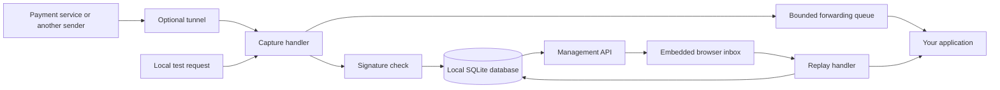

# How OmniHook is built

OmniHook is a local inbox for HTTP requests sent by other applications. A webhook
is simply a message one application sends to another when something happens,
for example a payment completing. OmniHook saves that message so you can inspect
it and send it to your own application again while debugging.

## The pieces

A **tunnel** makes a local HTTP server reachable from outside your computer.
OmniHook does not provide a hosted tunnel. Once a request is saved, inspecting
and replaying it locally does not require the original provider or tunnel.

The **Go server** runs capture, management, forwarding, and cleanup in one
process. The browser pages are embedded in its executable, so a packaged binary
does not need a separate frontend server or a nearby assets folder. `WEB_DIR`
is an optional development override.

**SQLite** is the database engine. Its database is a file, not a separate server.
It stores endpoint settings, captured requests, and delivery attempts. WAL
(write-ahead logging) lets SQLite record changes in a companion file while
readers use the database; it does not make writes infinitely parallel.

## What is stored

| Record | Purpose | Example |
| --- | --- | --- |
| Endpoint | Named inbox and its settings | `payments`, Stripe secret, local target URL |
| Request | Original body bytes, headers, route, time, verification result | One `payment.completed` message |
| Replay record | Delivery outcome, also used by automatic forwarding | Target returned 500 in 12 ms, or connection failed |

The request body is saved as bytes before JSON display formatting. This matters
because signatures depend on the exact body: adding whitespace can change a
signature even when the JSON means the same thing. Header transport details
and hop-by-hop headers are not reproduced byte for byte.

A signature is a check made using the sender's shared signing secret. `PASS`
means the configured verification check succeeded; it does not prove your
application processed the event. `FAIL` remains useful debugging evidence and
is still captured. `SKIPPED` means no supported verifier was selected.

## Capture and delivery are separate

OmniHook saves a request before announcing it to the UI or scheduling a forward.
If storage fails, capture returns an error. Bodies over `MAX_BODY_BYTES` receive
413 and are not saved as apparently complete requests.

Automatic forwarding uses eight workers and a queue of 128 items. A slow target
cannot create unlimited forwarding goroutines. Queue drops and delivery failures
are recorded when storage is available. The provider response does not wait for
the target application to finish. This is a debugging inbox, not a durable
production delivery queue.

Server-sent events (SSE) are small notifications sent over an open HTTP response.
They tell the browser to refresh from the saved inbox. They are not the database
or a durable event log: reconnecting and refreshing must recover saved state.

## Exposure and limits

The default bind is `127.0.0.1`, reachable from the same computer. `ACCESS_TOKEN`
gates management routes and the UI; login sets an HttpOnly cookie. Capture
routes under `/hook/` remain public. Set a token before tunneling the instance,
use HTTPS for remote access, and treat the token as a credential.

Outbound requests allow localhost and private application addresses, block known
cloud metadata destinations including IPv4-mapped IPv6 forms, and do not follow
redirects. This is a limited guard: DNS rebinding protection is deferred. Avoid
exposing replay control to untrusted users.

## Where to look in the code

- `internal/capture`: receive, verify, save, notify, and queue forwarding.
- `internal/api` and `internal/webui`: management endpoints and browser pages.
- `internal/verify`: provider-specific signature checks and re-signing.
- `internal/replay`, `internal/forward`, `internal/outbound`: delivery and shared HTTP policy.
- `internal/db` and `migrations`: database initialization and versioned upgrades.
- `internal/cli`: commands that work directly with the local database.
- `internal/gc`: retention cleanup.

Read [flow.md](flow.md) for a concrete debugging session and [why.md](why.md)
for the problem and tradeoffs. See [storage.md](storage.md) before backing up or
sharing a database.
